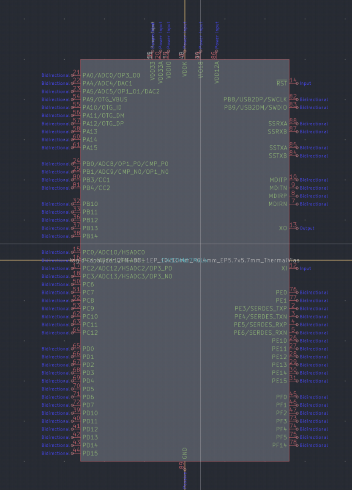
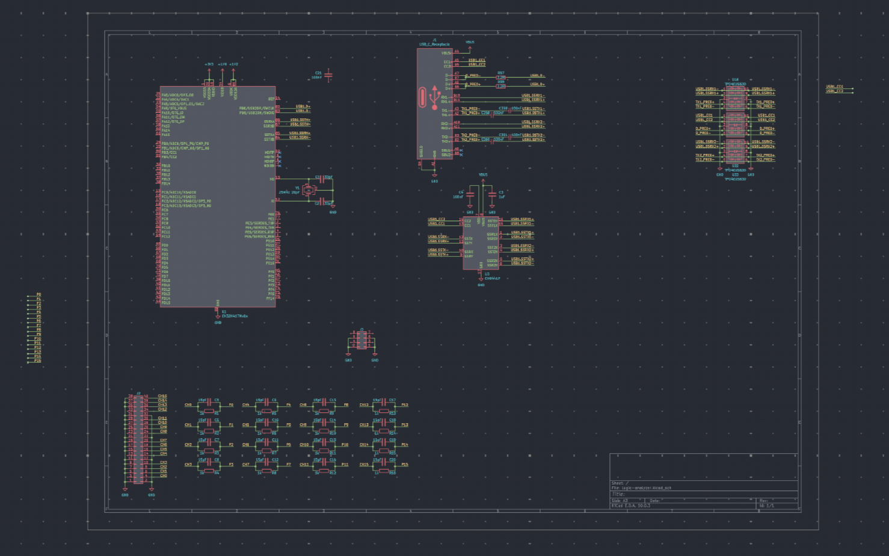
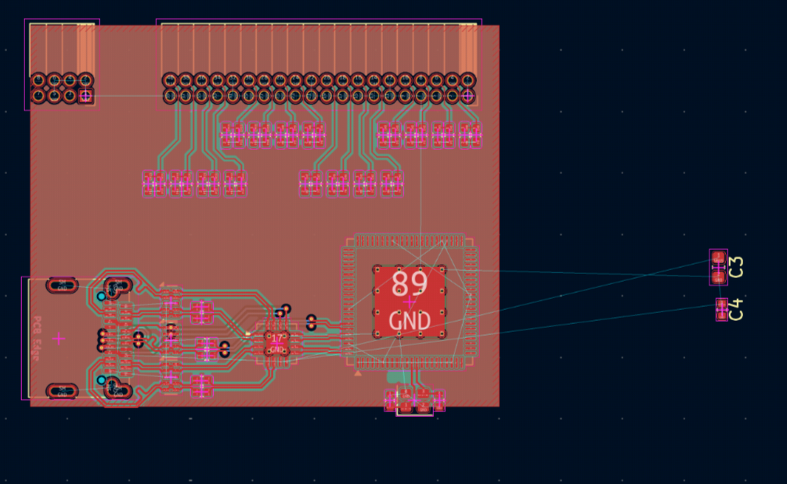
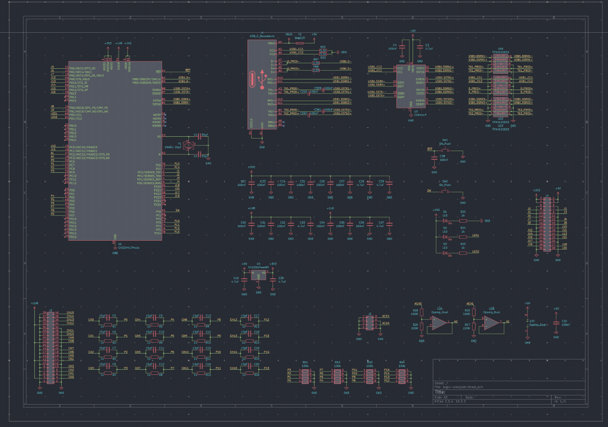
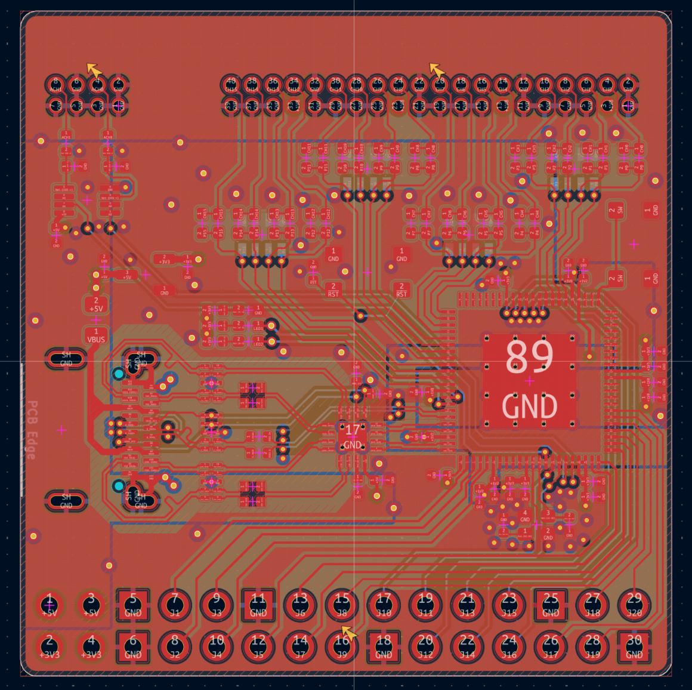
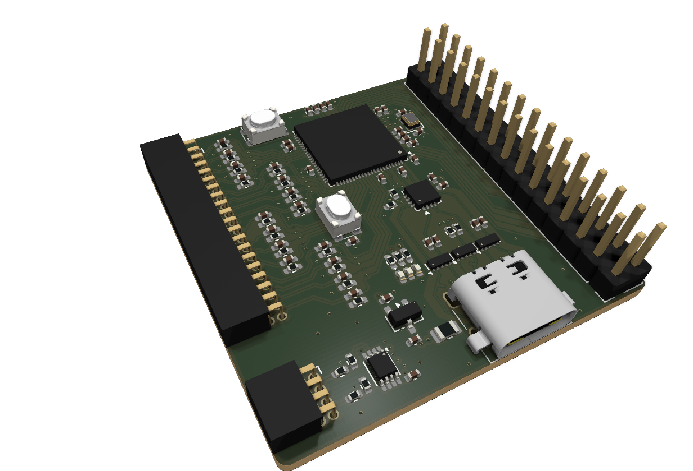
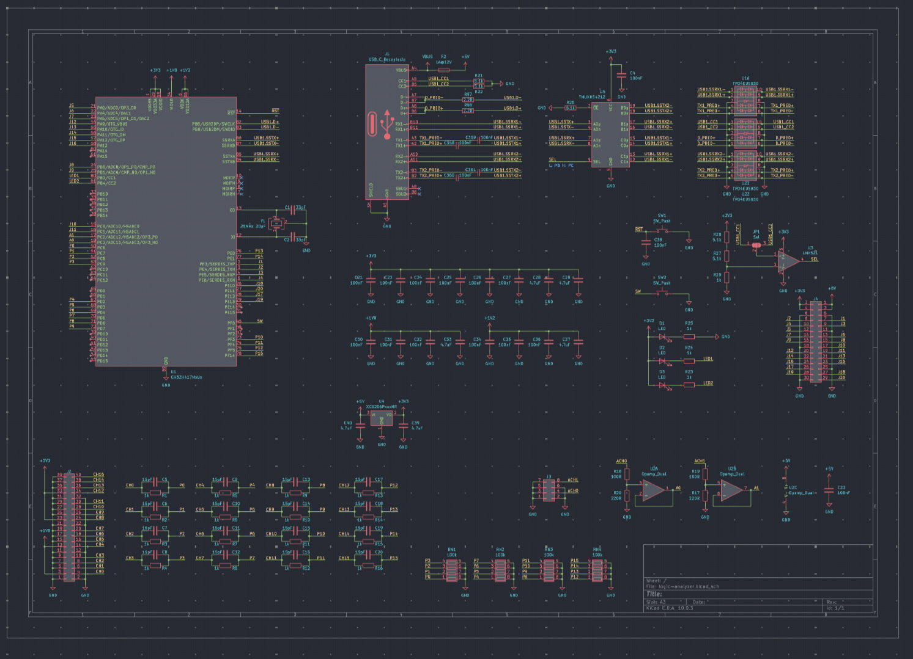
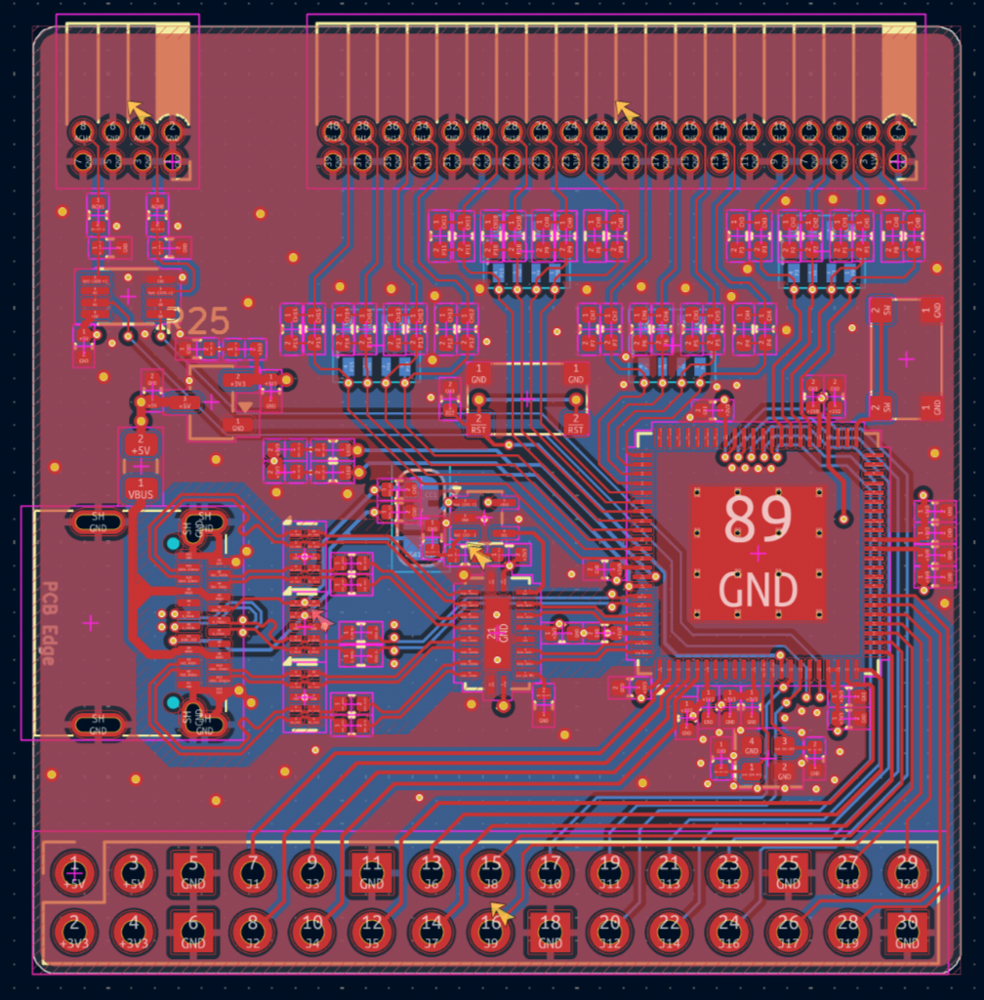

Day 1 - 1.2h

Drew the CH32H417 symbol and its QFN-88 footprint

---

Day 2 - 4h

Improved the schmatic, picked some chips

And started laying the board out

---

Day 3 - 6.6h

Finished the schematic! Added a ADC opamp voltage conv, power circuits and decoupling n more

Then routed out the PCB, took into acount the super-high-speed routes etc

Also spent a bit of time fixing all the 3d models

---

Day 4 - 3h

Changed the unavailable parts to something more common, and used a opamp to trigger the switch instead of mcu firmware. Studied this circuit a tiny bit.

Also re-did the high speed routing:

