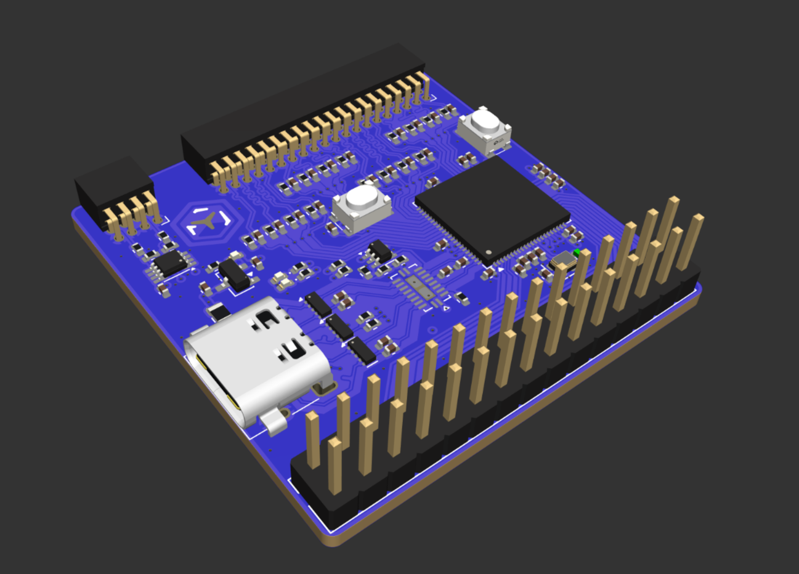
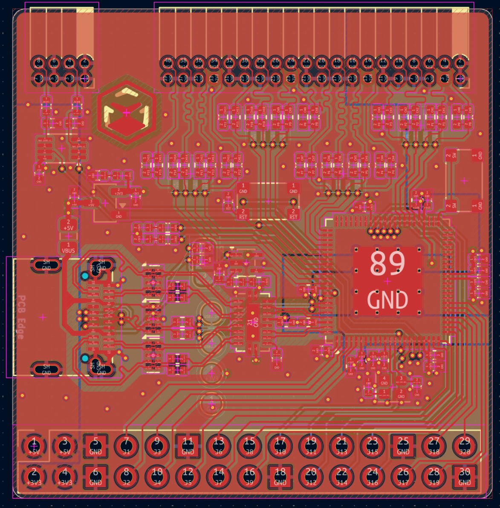

# 200Msps 16ch logic analyzer + 20Msps oscilloscope

This is a cheap 200Msps logic analyzer with a 20Msps analog component. It uses USB 3.2 to send data to the computer, and can also act as a ch32h417 development board.

It is usable with pulseview delivering a beautiful interface and allowing you to view all kinds of diffrent protocols. And with voltage changing, it supports 1.2V, 3.3V and 5V opration modes.

The analog channels support 20Msps at 10bit accuracy, or 5MHz at 12bit accuracy. Input range is from 0V to 5V, and it supports external triggering too!

The bottom row of header breaks out GPIO pins of various protocols, allowing the board to also become a devboard that can be programed via USB.

---

The PCB is a 4-layered board in order to preserve signal intergity on the USB 3.2 data lines. With high-quality TI active components to preserve signal quality.

